# Credit_Risk_Analysis
## Overview of Analysis

### In this analysis we will apply different machine learning models to a dataset from a peer-to-peer lending service, LendingClub, to predict credit risk. The different machine learning models we will be unisg are: Naive Random Oversampling, SMOTE Oversampling, Cluster Centroid Undersampling, SMOTEENN, Random Forest Classifier, Easy Ensamble Classifier.

## Results

### In order to understand the results from applying the machine learning models to our dataset we will be looking at some specific metrics. These metrics are...
### "Precision", or positive predictive value. Precision is measured by getting the number of True Positives, when something is actually true and also predicted to be true. Then the True Positive number is divided by iteself and added to the number of False Positives, when something is actually False but predicted to be True. 
### "Recall (Sensativity)" is measured by getting the number of True Positives. Then the True Positive number is divided by iteself and added to the number of False Negatives, when something is actually True but predicted to be False.
### "Accuracy Score" can be used to determine the performance of a classification model. It is measured by adding the True Positive rate added to the True Negative rate and dividing it by two. True Negatives are when something is predicted to be False and is actually False. 

 - **Naive Random Oversampling:** With Random Oversampling we balance the dataset by adding randomly adding data from the minority class to the training set until the major and minor classes have the same amount of data to train on. Here, for the high risk loans, we have a Precision score of 1%, a Recall score of 60%, and an Accuracy Score of 64%. 

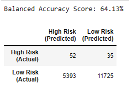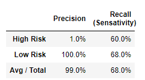

 - **SMOTE Oversampling:** With SMOTE the model interpolates new data points to add to the minority class until it is balanced with the Majority class for training. Here, for the high risk loans, we have a Precision score of 1%, a Recall score of 60%, and an Accuracy Score of 64%. 

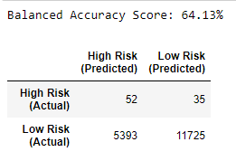

 - **Cluster Centroid Undersampling:** Cluster Centroid undersampling generates synthetic data points that are representative of the classes then balances the Major and Minor classes by removing points from the Major class until the two are balanced. Here, for the high risk loans, we have a Precision score of 1%, a Recall score of 61%, and an Accuracy Score of 53%.

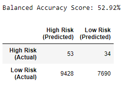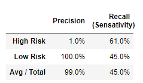

 - **SMOTEENN:** With SOTEENN we first apply SMOTE Oversampling, then we undersample the resulting data. Here, for the high risk loans, we have a Precision score of 1%, a Recall score of 70%, and an Accuracy Score of 64%.

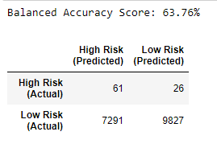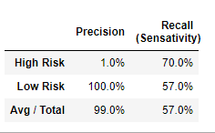

 - **Random Forest Classifier:** Random Forest classifier samples the data by building several simple decision trees and then those are combined to classify the data. Here, for the high risk loans, we have a Precision score of 73%, a Recall score of 64%, and an Accuracy Score of 67%.

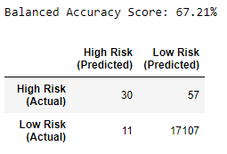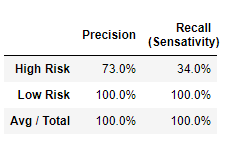

 - **Easy Ensamble Classifier:** Easy Ensamble classifier is an ensamble of AdaBoost learners and uses random Undersampling. Here, for the high risk loans, we have a Precision score of 7%, a Recall score of 91%, and an Accuracy Score of 93%.

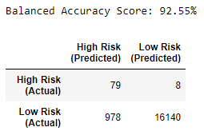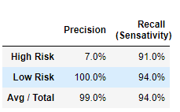

## Summary

### Looking 
